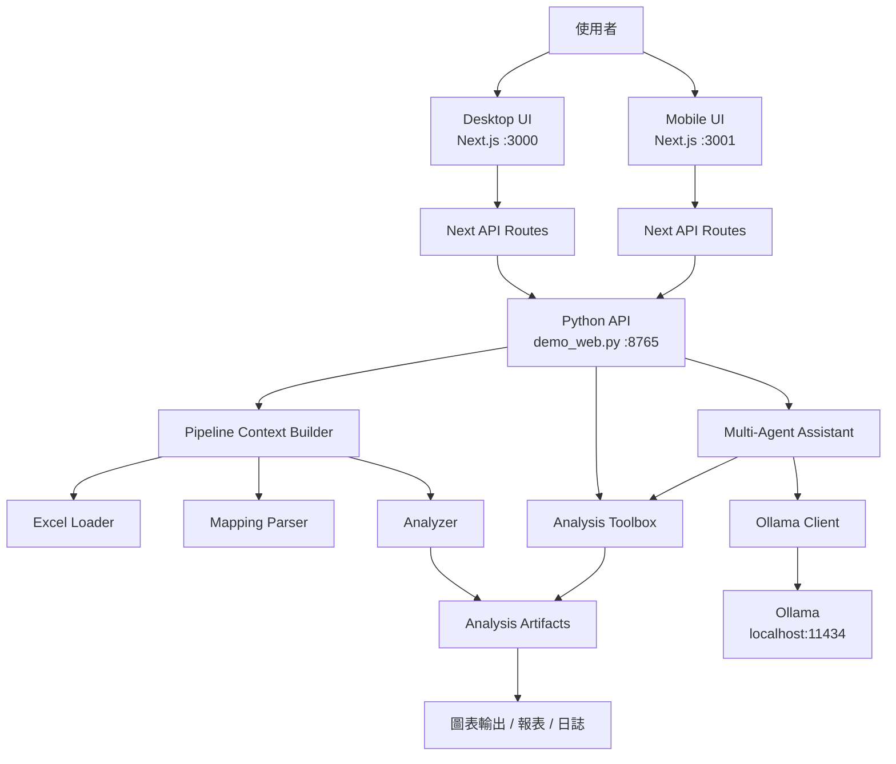
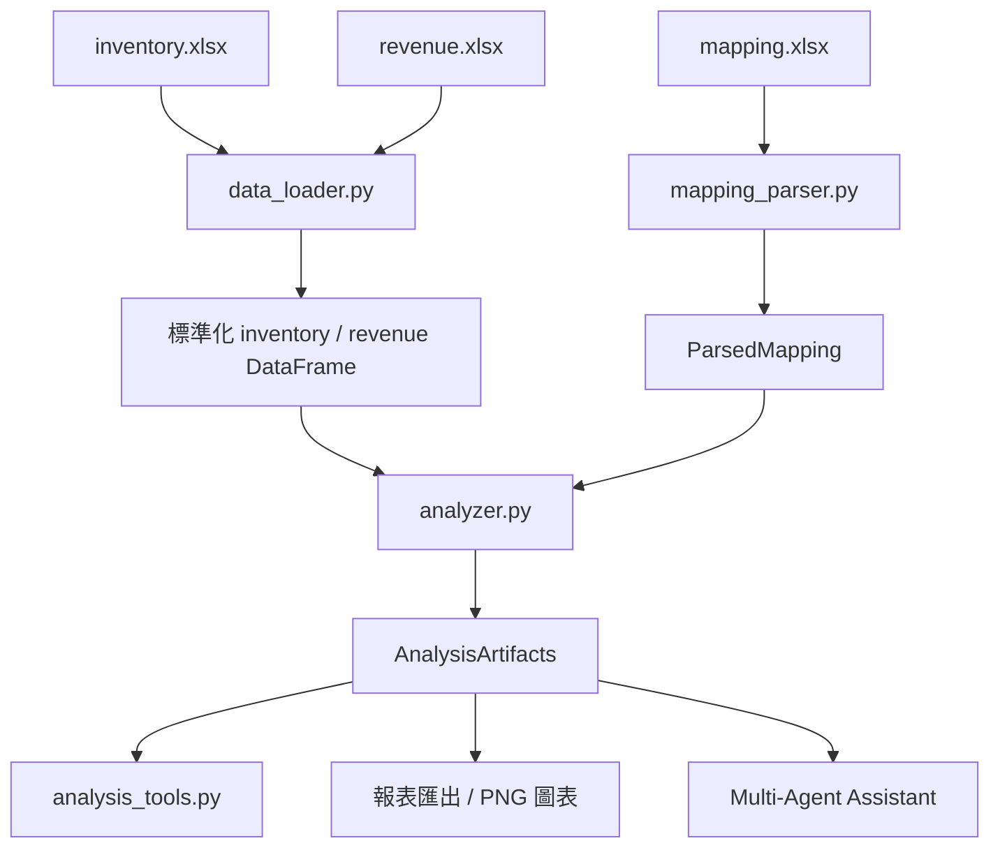
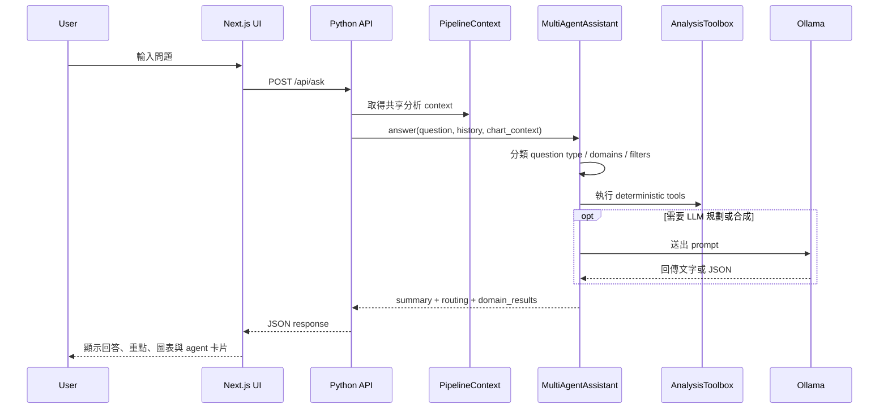

# Revenue POC 技術報告

## 1. 專案總覽

本專案是一個以 Excel 為資料來源的營收與庫存分析 PoC，核心目標是把原始表格、對照關係與商業問答整合成同一套可重用的分析系統。

目前系統由三層組成：

1. Python 分析後端：負責讀取 Excel、解析 mapping、計算 KPI、異常與關聯分析，並提供 API。
2. Desktop Web 前端：提供分析師導向的桌機操作介面與 multi-agent 問答體驗。
3. Mobile Web 前端：提供管理者導向的行動版 KPI 與輕量 AI 問答介面。

目前執行中的服務入口如下：

- Python API：`http://127.0.0.1:8765`
- 桌機版 UI：`http://127.0.0.1:3000`
- 手機版 UI：`http://127.0.0.1:3001`

系統的關鍵設計原則是「同一份分析真相來源」。也就是說，無論是圖表、摘要、觀察表、agent 回答或匯出檔案，全部都建立在同一套 `PipelineContext` 與 `AnalysisArtifacts` 上，而不是各自重算或在前端重寫邏輯。

## 2. 專案目標

本專案主要解決以下四類問題：

1. 將 `inventory.xlsx`、`revenue.xlsx`、`mapping.xlsx` 轉成可分析的標準化資料。
2. 解析事業群、HQBU、平台代碼與匿名化規則之間的對照關係。
3. 產出月趨勢、群組排名、異常訊號、關聯分析、圖表 payload 與匯出報表。
4. 透過 multi-agent assistant 讓使用者能以自然語言詢問營收、庫存、異常與圖表相關問題。

## 3. 輸入與輸出

### 3.1 輸入資料

系統預設讀取 `data/` 目錄下的三份 Excel：

- `data/inventory.xlsx`
- `data/revenue.xlsx`
- `data/mapping.xlsx`

這些路徑定義於 [config.py](/abs/path/c:/Users/itzel.hsiao/Desktop/revenue-poc/config.py:4)。

### 3.2 輸出成果

系統分析完成後，會在 `output/` 產出下列成果：

- 清洗後的 inventory 與 revenue Excel
- 解析後的 mapping Excel
- merged analysis Excel
- summary metrics Excel
- Markdown 分析報告
- LLM 補充說明
- QA transcript
- PNG 圖表
- 統一 request log

輸出檔案定義於 [config.py](/abs/path/c:/Users/itzel.hsiao/Desktop/revenue-poc/config.py:10)。

## 4. 整體架構

### 4.1 系統架構圖

### 4.2 啟動方式

目前的啟動腳本為：

- [scripts/start_backend.ps1](/abs/path/c:/Users/itzel.hsiao/Desktop/revenue-poc/scripts/start_backend.ps1:1)
- [scripts/start_frontend.ps1](/abs/path/c:/Users/itzel.hsiao/Desktop/revenue-poc/scripts/start_frontend.ps1:1)
- [scripts/start_mobile.ps1](/abs/path/c:/Users/itzel.hsiao/Desktop/revenue-poc/scripts/start_mobile.ps1:1)
- [scripts/start_all.ps1](/abs/path/c:/Users/itzel.hsiao/Desktop/revenue-poc/scripts/start_all.ps1:1)

其中 `start_all.ps1` 已整理為一鍵啟動：

1. 啟動 Python API
2. 啟動桌機版前端
3. 啟動手機版前端

## 5. 後端架構

### 5.1 API 層

HTTP 入口位於 [demo_web.py](/abs/path/c:/Users/itzel.hsiao/Desktop/revenue-poc/demo_web.py:1)。

目前它的責任是：

- 啟動時建立共享的分析 context
- 提供後端 API
- 作為桌機版與手機版共同依賴的資料服務

主要 API：

- `GET /`
- `GET /api/summary`
- `GET /api/chart-catalog`
- `GET /api/observe-options`
- `POST /api/ask`
- `POST /api/chart`
- `POST /api/observe`

其中 `GET /` 現在只回傳 API 狀態 JSON，不再承載舊版第一代靜態 web demo。

### 5.2 PipelineContext

[analysis_pipeline.py](/abs/path/c:/Users/itzel.hsiao/Desktop/revenue-poc/analysis_pipeline.py:1) 是後端的共享骨幹。

`PipelineContext` 包含：

- 原始與標準化後的 inventory / revenue DataFrame
- 解析後的 mapping 結構
- 全部分析 artifacts
- 讀檔、mapping、分析過程中累積的訊息
- domain 能力標記
- source file metadata

這個設計讓系統只需要分析一次，後續 API、圖表、agent 問答都能直接重用結果。

### 5.3 Excel 讀取與標準化

資料讀取由 [data_loader.py](/abs/path/c:/Users/itzel.hsiao/Desktop/revenue-poc/data_loader.py:1) 與 [preprocess.py](/abs/path/c:/Users/itzel.hsiao/Desktop/revenue-poc/preprocess.py:1) 負責。

主要流程如下：

1. 使用 `openpyxl` 讀取 Excel。
2. 依照 `config.py` 中的欄位契約檢查必填欄位。
3. 將日期標準化為月份欄位。
4. 正規化代碼欄與文字欄。
5. 將營收、庫存金額、QTY、事業群代碼轉為數值型態。

這一層的特點是輸入契約明確，因此當來源 Excel 變更時，系統會盡快在載入階段報錯，而不是在後段靜默產生錯誤分析。

### 5.4 Mapping 解析

對照表解析邏輯位於 [mapping_parser.py](/abs/path/c:/Users/itzel.hsiao/Desktop/revenue-poc/mapping_parser.py:1)。

系統會將 mapping workbook 前九欄轉成幾個結構化表：

- business group mapping
- inventory HQBU mapping
- revenue platform mapping
- anonymization rules
- bridge candidates

關鍵設計如下：

- HQBU 與平台代碼都會檢查是否符合 `GG-01` 到 `GG-91` 的格式。
- 透過 business group code 將 inventory 與 revenue 兩側關聯起來。
- 若 HQBU 與平台代碼完全相同，視為高信心 direct match。
- 若存在多對一或模糊 bridge，不強制推論，而是以 warning 形式暴露風險。

這一層是整個分析是否能把庫存與營收對齊的核心。

### 5.5 分析引擎

核心分析邏輯位於 [analyzer.py](/abs/path/c:/Users/itzel.hsiao/Desktop/revenue-poc/analyzer.py:1)。

它會產生 `AnalysisArtifacts`，內容包括：

- inventory_enriched
- revenue_enriched
- monthly_revenue
- monthly_inventory_amount
- monthly_inventory_qty
- revenue_by_group
- inventory_by_group
- merged_analysis
- platform_monthly_analysis
- anomalies
- correlation_analysis
- summary_metrics
- report_context

主要分析步驟如下：

1. 將 inventory 與 revenue 資料補上 mapping 資訊。
2. 依月份彙總營收、庫存金額與庫存數量。
3. 依 business group 彙總營收與庫存。
4. 依月份、群組、平台做對齊合併。
5. 計算營收對庫存金額、營收對庫存數量等 proxy ratio。
6. 偵測單月異常、庫存升營收降、低 ratio 等異常模式。
7. 計算月層級、群組層級、平台層級的相關性。

### 5.6 Tool Layer

[analysis_tools.py](/abs/path/c:/Users/itzel.hsiao/Desktop/revenue-poc/analysis_tools.py:1) 是後端最重要的抽象層之一。

它把 `AnalysisArtifacts` 封裝成穩定工具介面，供 API 與 multi-agent 使用。主要能力包含：

- `get_data_coverage`
- `get_tool_capability_matrix`
- `get_metric_table`
- `get_top_groups`
- `get_platform_ratios`
- `get_anomalies`
- `get_correlations`
- `get_mapping_summary`
- `get_chart_catalog`
- `get_chart_payload`
- `create_chart_image`
- `get_observation_options`
- `get_observation_table`

這一層同時集中管理：

- chart definition
- 每種 metric 支援的 filters
- observation table 的欄位邏輯
- chart payload contract

這讓前端與 agent 不需要直接理解底層 DataFrame 結構。

### 5.7 Multi-Agent Assistant

multi-agent 邏輯位於 [multi_agent.py](/abs/path/c:/Users/itzel.hsiao/Desktop/revenue-poc/multi_agent.py:1)。

主要結構包含：

- Router：決定問題類型、domain、filters 與 subtasks
- Domain agents：例如 sales、inventory、financial、association、chart
- AnalysisToolbox：所有 agent 共用的 deterministic tool layer
- OllamaClient：必要時進行規劃與語意合成
- Final synthesizer：把多個 domain 結果整理成最終回答

這個 assistant 不是「全部交給 LLM」，而是混合式設計：

- 能 deterministic 的地方先 deterministic
- LLM 只負責規劃、補述或整理
- 回答盡量建立在工具產生的證據之上

### 5.8 LLM 與 fallback 設計

LLM 整合位於 [ollama_client.py](/abs/path/c:/Users/itzel.hsiao/Desktop/revenue-poc/ollama_client.py:1)。

目前設定如下：

- Base URL：`http://localhost:11434`
- Model：`gemma4:e4b`
- Timeout：90 秒

重要的是，系統不是完全依賴 Ollama：

- LLM 不可用時，仍可回傳 deterministic 結果
- JSON parse 失敗時有 fallback
- question routing 與 evidence-first composition 仍能部分運作

### 5.9 Logging

日誌系統位於 [logging_utils.py](/abs/path/c:/Users/itzel.hsiao/Desktop/revenue-poc/logging_utils.py:1)。

每次請求都會帶有：

- `request_id`
- `domain`
- console log
- file log

主要 log 檔為：

- `output/logs/multi_agent_assistant.log`

這能用來追查：

- router decision
- tool execution
- LLM 是否失敗
- 哪個 domain 回傳 warning

## 6. 前端架構

### 6.1 Desktop Web

桌機版專案位於 `frontend/`，採用 Next.js App Router。

關鍵檔案：

- [frontend/app/page.js](/abs/path/c:/Users/itzel.hsiao/Desktop/revenue-poc/frontend/app/page.js:1)
- [frontend/components/insight-console.jsx](/abs/path/c:/Users/itzel.hsiao/Desktop/revenue-poc/frontend/components/insight-console.jsx:1)
- [frontend/components/message-card.jsx](/abs/path/c:/Users/itzel.hsiao/Desktop/revenue-poc/frontend/components/message-card.jsx:1)
- [frontend/components/chart-surface.jsx](/abs/path/c:/Users/itzel.hsiao/Desktop/revenue-poc/frontend/components/chart-surface.jsx:1)
- [frontend/lib/python-api.js](/abs/path/c:/Users/itzel.hsiao/Desktop/revenue-poc/frontend/lib/python-api.js:1)

桌機版定位偏分析師工作台，功能較完整，包含：

- 專案摘要
- 對話區
- multi-agent 回答卡片
- dashboard chart
- observation table
- chart filter 與切換
- history context 傳入問答

### 6.2 Mobile Web

手機版專案位於 `mobile-demo/`，同樣採用 Next.js。

關鍵檔案：

- [mobile-demo/app/page.js](/abs/path/c:/Users/itzel.hsiao/Desktop/revenue-poc/mobile-demo/app/page.js:1)
- [mobile-demo/components/mobile-console.jsx](/abs/path/c:/Users/itzel.hsiao/Desktop/revenue-poc/mobile-demo/components/mobile-console.jsx:1)
- [mobile-demo/components/chart-surface.jsx](/abs/path/c:/Users/itzel.hsiao/Desktop/revenue-poc/mobile-demo/components/chart-surface.jsx:1)
- [mobile-demo/lib/python-api.js](/abs/path/c:/Users/itzel.hsiao/Desktop/revenue-poc/mobile-demo/lib/python-api.js:1)

手機版定位偏管理層快覽，特徵為：

- KPI tile
- 單頁 dashboard
- drawer 式 AI 對話
- 簡化的 chart interaction

### 6.3 Next API Proxy

桌機版與手機版都各自提供 `app/api/*/route.js`，作為前端同源 API 入口，再轉發到 Python API。

常見路由包含：

- `summary`
- `chart-catalog`
- `chart`
- `ask`
- `observe`
- `observe-options` 只存在桌機版

這個模式的優點是：

- 前端不需要直接暴露跨域 Python URL
- 可保留同源 fetch 模式
- 後續若要抽換後端入口，改動面較集中

## 7. 資料與請求流程

### 7.1 分析資料流

### 7.2 問答請求流程

## 8. API 設計摘要

### 8.1 讀取型 API

- `GET /api/summary`
  回傳專案摘要、最新月份分析、dashboard snapshot、異常與能力資訊。

- `GET /api/chart-catalog`
  回傳可用圖表清單與支援的 filter。

- `GET /api/observe-options`
  回傳 observation mode 可選的月份、平台、群組與 comparison options。

### 8.2 動作型 API

- `POST /api/chart`
  輸入 chart key 與 filters，回傳 chart payload 與可選 image。

- `POST /api/observe`
  輸入 observation 參數，回傳結構化比較表。

- `POST /api/ask`
  輸入自然語言問題與可選 context，回傳 router、domain results 與 summary。

## 9. 架構優勢

### 9.1 單一分析真相來源

目前最大的優勢，是整個專案不是每個模組各算各的，而是建立在同一份 artifacts 上。這可以降低：

- 前後端數字不一致
- 問答回答與圖表不一致
- 匯出報表與 dashboard 指標不一致

### 9.2 Tool abstraction 清楚

`AnalysisToolbox` 是很好的中介層，讓上層只需要操作工具，不必直接觸碰底層 DataFrame 拼接邏輯。

### 9.3 LLM 不是單點依賴

系統保留 deterministic 路徑，因此即使 Ollama 暫時失效，仍可輸出部分分析成果。

### 9.4 Log 可追蹤

透過 request_id 與 domain log，可以回溯一次問答到底經過哪些 router、工具與 agent。

## 10. 目前技術債與風險

### 10.1 桌機版與手機版仍是兩套 Next.js 專案

目前 `frontend/` 與 `mobile-demo/` 各自擁有：

- package.json
- node_modules
- API proxy
- chart component
- 啟動流程

這代表維護成本偏高，且很容易出現桌機版與手機版規格飄移。

### 10.2 原始碼中仍有亂碼字串

部分 Python 與前端字串出現 mojibake，這會影響：

- 維護可讀性
- 使用者介面文案品質
- 報告與後續開發溝通

### 10.3 後端啟動時就建完整 context

目前 `demo_web.py` 啟動時就會完整建立 pipeline context。這雖然簡潔，但也代表：

- 啟動成本依賴資料大小
- 若 Excel 更新，需要重啟服務才能完全刷新
- 不適合更大規模資料量

### 10.4 API proxy duplicated

桌機版與手機版都有幾乎相同的 Python proxy helper，雖然不大，但確實是重複架構。

### 10.5 Excel schema 耦合度高

專案對 Excel 欄位名稱與欄位位置依賴很深，若資料源格式改動，整體會受到明顯影響。

## 11. 建議的簡化路線

### 第一階段

先穩定現況：

- 清理所有舊文檔中誤導性的啟動方式
- 修正亂碼與文案
- 為 `summary`、`chart-catalog`、`ask` 建立 smoke test

### 第二階段

將 `frontend/` 與 `mobile-demo/` 合併成單一 Next.js 專案：

- 共用一份 package.json
- 共用一份 API route
- 共用一份 chart component
- 依 responsive layout 或 route variant 分桌機與手機體驗

這是整個專案最有價值的減法。

### 第三階段

更清楚地分離 API server 職責：

- 將 `demo_web.py` 視為 API bootstrap
- 若 API 進一步擴大，可考慮改為 FastAPI 等框架

### 第四階段

導入資料刷新與 cache 策略：

- 來源 Excel 變更時的 context reload
- chart payload 快取
- dataset version metadata

## 12. 建議運作模式

在目前架構下，建議以下使用方式：

1. 用 [scripts/start_all.ps1](/abs/path/c:/Users/itzel.hsiao/Desktop/revenue-poc/scripts/start_all.ps1:1) 一鍵啟動全部服務。
2. 將 `8765` 僅視為 Python API。
3. 將 `3000` 作為桌機分析工作台。
4. 將 `3001` 作為手機或管理層快覽介面。
5. 將 `output/logs/multi_agent_assistant.log` 作為主要除錯依據。

## 13. 結論

這個專案已經具備一個完整資料分析產品雛形所需的主要骨架：

- 資料載入
- mapping 解譯
- 指標分析
- 圖表輸出
- multi-agent 問答
- 桌機 / 手機雙端呈現

它目前最值得做的，不是繼續加功能，而是繼續做減法：

- 合併雙前端
- 去除重複 proxy
- 清理亂碼字串
- 持續維持單一分析真相來源

若沿著這條路線演進，這個 PoC 會更容易轉成可維運、可擴充的內部分析產品。
